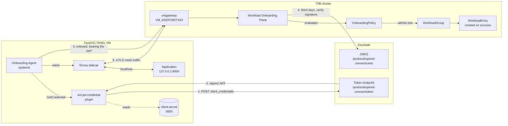
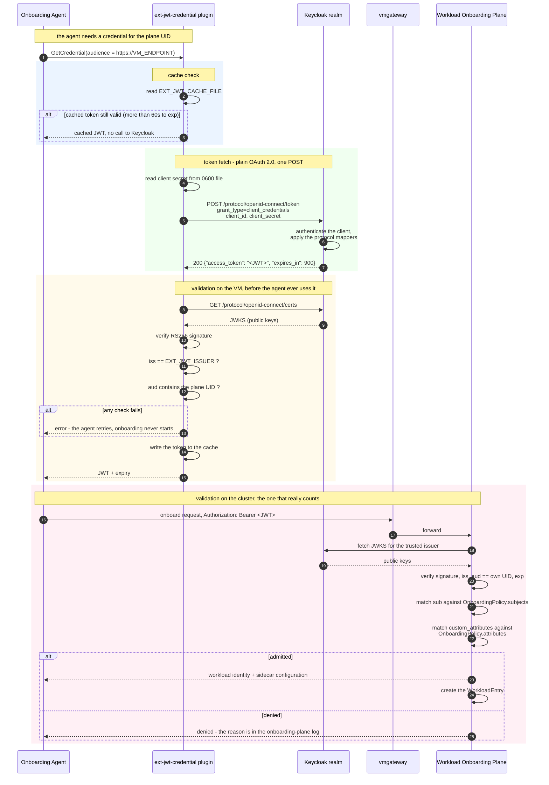
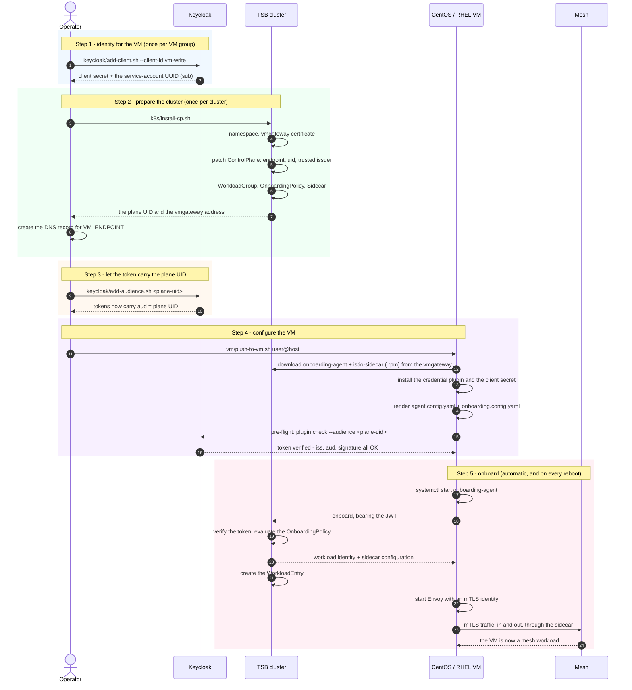
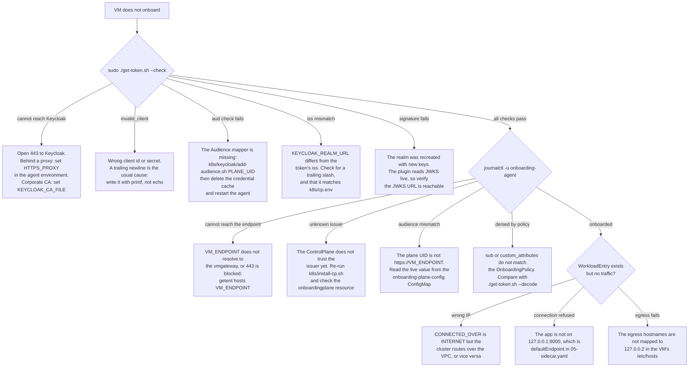

# Onboarding a CentOS / RHEL VM into TSB with JWT tokens

This repository onboards an on-premises Linux VM into a Tetrate Service Bridge
mesh, using a **JWT issued by Keycloak** as the VM's proof of identity.

The VM authenticates to Keycloak as an OAuth 2.0 client (the `client_credentials`
grant), receives a signed JWT, and presents it to the TSB Workload Onboarding
Plane. The plane verifies the signature and the claims, matches them against an
`OnboardingPolicy`, and admits the VM into a `WorkloadGroup` as a mesh workload
with its own Envoy sidecar and mTLS identity.

No human logs in, no long-lived certificate is copied onto the VM, and no token
is ever generated by hand: the only secret on the VM is a Keycloak client secret
in a `0600` file, and tokens are minted on demand and renewed automatically.

| | |
| --- | --- |
| **Supported VMs** | CentOS 7+, RHEL 7/8/9, Rocky, Alma, Amazon Linux, Fedora (`.rpm`); Ubuntu, Debian (`.deb`) |
| **Architectures** | `x86_64` / `amd64`, `aarch64` / `arm64` |
| **Identity provider** | Keycloak (any OIDC issuer that mints RS256 JWTs works the same way) |
| **Token lifetime** | Keycloak's client token lifespan (900 s by default), renewed 60 s before expiry |

## Repository layout

```
.
├── k8s/        control plane: run once per cluster
│   ├── install-cp.sh            applies everything below, then verifies it
│   ├── cp.env                   every value the manifests are rendered with
│   ├── 00-namespace.yaml        the namespace the VM workloads join
│   ├── 01-cert.yaml             serving certificate for the vmgateway
│   ├── 02-control-plane-patch.yaml  onboarding endpoint, plane UID, trusted issuer
│   ├── 03-workload-group.yaml   Service, ServiceAccount, WorkloadGroup
│   ├── 04-onboarding-policy.yaml    which tokens may onboard
│   ├── 05-sidecar.yaml          sidecar config for VMs without iptables
│   └── keycloak/                client and audience-mapper setup
├── terraform/  optional: create the VMs in AWS, GCP and/or Azure
│   ├── deploy.sh                drives one or more per-cloud stacks
│   ├── common.tfvars.example    settings shared by every cloud
│   ├── stacks/{aws,gcp,azure}/  one Terraform root per cloud, own state
│   └── modules/                 the reusable network + instance definitions
└── vm/         the VM: run once per machine
    ├── install-vm.sh            entry point, run on the VM as root
    ├── push-to-vm.sh            copies this folder to a VM and runs the above
    ├── get-token.sh             fetch a token and validate its claims
    ├── vm.env                   endpoint, workload group, Keycloak client
    ├── ext-jwt.env              the same settings, for running the plugin by hand
    ├── bin/                     the credential plugin and the demo app binary
    ├── lib/                     the install steps, in order
    └── templates/               what gets rendered into /etc/onboarding-agent
```

## How it fits together



Three values have to agree across the three sides, and almost every onboarding
failure is one of them being wrong:

| Value | Set on the cluster | Must match on the VM | Must match in Keycloak |
| --- | --- | --- | --- |
| **Issuer** | `KEYCLOAK_REALM_URL` in `k8s/cp.env` | `KEYCLOAK_REALM_URL` in `vm/vm.env` | the realm URL, i.e. the token's `iss` |
| **Plane UID** | `uid: https://${VM_ENDPOINT}` | `ONBOARDING_PLANE_UID` | the Audience mapper, so it lands in `aud` |
| **Subject** | `ALLOWED_SUBJECTS` | — | the client's service-account UUID (`sub`) |

## The JWT: from fetch to validation

This is the part that decides whether a VM onboards. Everything below happens on
every credential request, without human involvement.



A token from this flow looks like the following. The three claims the plane acts
on are `iss`, `aud` and `sub`; `custom_attributes` is optional and only needed if
the policy matches on it.

```json
{
  "iss": "https://keycloak.example.com/realms/tetrate",
  "aud": ["https://vms.cluster.example.com", "account"],
  "sub": "6a0fa1d1-0235-4d15-98a1-ada0bfe9f71e",
  "azp": "vm-write",
  "custom_attributes": { "region": "uscentral1", "datacenter": "datacenter1" },
  "exp": 1760000900
}
```

> **The one Keycloak quirk worth knowing.** The plugin asks Keycloak for a token
> whose audience is the plane's UID, but **Keycloak ignores the `audience`
> parameter on the `client_credentials` grant**. It does not fail - it just
> returns a token with the wrong `aud`, which the plane then rejects. The UID has
> to be injected by an **Audience protocol mapper** on the client instead, which
> is what [`k8s/keycloak/add-audience.sh`](k8s/keycloak/add-audience.sh) does.
> This is the single most common cause of a VM that looks correctly configured and
> still never onboards.

## The onboarding process, end to end



---

# Step-by-step

## Prerequisites

**On the machine you run this from** (your laptop or a jump host):

| Tool | Needed for |
| --- | --- |
| `kubectl` | applying the control plane manifests; context with cluster-admin on the TSB cluster |
| `envsubst` (gettext) | rendering the manifests and templates |
| `ssh`, `scp` | `vm/push-to-vm.sh` |
| `jq` | `k8s/keycloak/add-client.sh` only |

**On the VM:**

```shell
# RHEL / CentOS / Rocky / Alma
sudo dnf install -y curl gettext libcap      # yum on CentOS 7 / RHEL 7

# Ubuntu / Debian
sudo apt-get install -y curl gettext-base libcap2-bin
```

`python3` is optional; `get-token.sh --decode` uses it to pretty-print and check
the claims. RHEL 8 and 9 and CentOS Stream ship it already.

**Network access from the VM:**

| To | Port | Why |
| --- | --- | --- |
| `VM_ENDPOINT` (the vmgateway) | 443 | download the packages, then onboard and carry mesh traffic |
| the Keycloak host | 443 | fetch the token and the JWKS document |

**Already in place:** a TSB management plane with a control plane on the target
cluster, and a reachable Keycloak with a realm you can administer.

## Step 0 (optional) - create the VMs

If the VMs already exist - on-premises hardware, an existing hypervisor, or
instances someone else manages - skip this and go to step 1.

To have Terraform create them in AWS, GCP or Azure, in any combination:

```shell
cd terraform
cp common.tfvars.example common.tfvars
vi common.tfvars                                  # SSH CIDR, key, mesh CIDRs, onboarding
cp stacks/aws/aws.tfvars.example stacks/aws/aws.tfvars
vi stacks/aws/aws.tfvars                          # region, instance_count, size

./deploy.sh apply aws                             # or: aws gcp azure
```

Each cloud is a separate stack with its own state, so an AWS-only run needs AWS
credentials only. `private_instances = true` puts the instances in a private
subnet with egress through a managed NAT gateway, and adds one public mesh VM
that doubles as the SSH jump host - it is onboarded and carries traffic like the
others, so nothing sits idle.

The sandbox accounts enforce a tag policy, so `common.tfvars` carries the
mandatory `tetrate_tags` (owner, team, purpose, lifespan, customer). They are
applied to every taggable resource in all three clouds, and an empty value fails
the plan rather than producing a resource the account would reject.

The instances come up prepared but **not** onboarded: cloud-init installs the
prerequisites and writes a ready-to-use `vm.env` to `/opt/vm-onboarding/`, and
step 4 below finishes the job. `./deploy.sh onboard` prints the exact command per
instance.

Details: [`terraform/README.md`](terraform/README.md).

## Step 1 - create the Keycloak client

One client per group of VMs that share an identity and a policy. Skip this if the
realm already has the clients (`vm-write` / `vm-readonly` in the Tetrate sandbox
realm).

```shell
cd k8s/keycloak
./add-client.sh \
  --client-id vm-rhel-prod \
  --secret '<a strong secret>' \
  --plane-uid https://vms.cluster.example.com \
  --region uscentral1 --datacenter datacenter1
```

It creates a confidential client with service accounts enabled, adds the Audience
mapper and the `custom_attributes` claim mappers, then requests a token and
prints its claims. **Note the `sub` it reports** - that is what the
`OnboardingPolicy` matches on.

See [`k8s/keycloak/README.md`](k8s/keycloak/README.md) for the admin-console
equivalent and for using an identity provider other than Keycloak.

## Step 2 - prepare the cluster

```shell
cd k8s
cp cp.env cp.env.local
vi cp.env.local          # context, VM_ENDPOINT, realm URL, namespace, ALLOWED_SUBJECTS
./install-cp.sh cp.env.local --dry-run    # review the rendered manifests
./install-cp.sh cp.env.local
```

This applies the namespace, the vmgateway certificate, the `WorkloadGroup`, the
`OnboardingPolicy` and the `Sidecar`, and merges the `ControlPlane` patch that
sets the onboarding endpoint, the plane UID and the trusted issuer. It then waits
for the TSB operator to hand the issuer to the onboarding plane and prints the
**plane UID** and the **vmgateway LoadBalancer address**.

Create the DNS record it asks for - `VM_ENDPOINT` must resolve to that address
from every VM:

```shell
kubectl -n istio-system get svc vmgateway
```

Details and per-field reference: [`k8s/README.md`](k8s/README.md).

## Step 3 - put the plane UID in the token

```shell
cd k8s/keycloak
./add-audience.sh 'https://vms.cluster.example.com'    # the UID printed in step 2
```

Needed once per plane UID, and `add-client.sh` already did it for clients it
created. Running it again is safe - it replaces the existing mapper.

## Step 4 - configure the VM

Put the plugin binary in `vm/bin/` (it is already committed here, built for
`linux-amd64`; rebuild for `arm64` if needed), then:

```shell
cd vm
cp vm.env vm.env.local
vi vm.env.local     # VM_ENDPOINT, ONBOARDING_PLANE_UID, workload group, client id

# from your laptop - copies this folder to the VM and runs install-vm.sh there
KEYCLOAK_CLIENT_SECRET='<the client secret>' \
  SSH_KEY=~/.ssh/vm.pem ENV_FILE=vm.env.local \
  ./push-to-vm.sh ec2-user@<vm-ip>
```

or, logged in on the VM itself:

```shell
sudo KEYCLOAK_CLIENT_SECRET='<the client secret>' ./install-vm.sh vm.env.local
```

If the VM came from `terraform/`, it already carries a matching env file - use it
instead of writing one:

```shell
cd terraform && ./deploy.sh onboard aws    # prints the command, ProxyJump included
# on the VM, the Terraform-written settings are at /opt/vm-onboarding/vm.env
```

Passing the secret in the environment keeps it out of any file in git; it is
written only to `/etc/onboarding-agent/client-secret`, mode `0600`, owned by the
`onboarding-agent` user.

The script installs the `.rpm` (or `.deb`) packages from the vmgateway, installs
the credential plugin, renders both agent config files, runs the pre-flight token
check, and starts the agent. It is safe to re-run: files are rewritten only when
their content changes, and services restart only when something changed.

Per-setting reference: [`vm/README.md`](vm/README.md).

## Step 5 - verify

**The token, on the VM** - a plain OAuth 2.0 request, no agent involved:

```shell
sudo ./get-token.sh --decode    # claims + iss / aud / sub / exp checks
sudo ./get-token.sh --check     # the plugin's own end-to-end check, incl. signature
sudo ./get-token.sh --curl      # print the equivalent curl command
```

`--decode` ends with what the policy must contain, so its output can be copied
straight into `k8s/cp.env`.

**The onboarding, on the cluster:**

```shell
kubectl -n payments get workloadentry
```

An entry appears per onboarded VM, named after the group, the issuer short name
and the token's subject - `payments-v1-jwt-keycloak--<sub>`. Its address is the
VM's IP, chosen according to `CONNECTED_OVER`.

```shell
# on the VM
journalctl -u onboarding-agent -f

# on the cluster
kubectl -n istio-system logs deploy/onboarding-plane -f | grep -E 'authenticated a workload|denied'
```

**The traffic**, if you installed the obs-tester demo app (`INSTALL_OBSTESTER="true"`):

```shell
kubectl -n payments run curl --rm -it --image=curlimages/curl -- \
  curl -s http://payments/
```

---

# Troubleshooting

Work from the token outwards: if `get-token.sh --check` passes, the problem is on
the cluster; if it fails, the problem is on the VM or in Keycloak.



| Symptom | Cause and fix |
| --- | --- |
| `the issuer minted a token with the audience "tsb-onboarding,account"` | The Audience mapper is missing, or was added to a different client. Run `k8s/keycloak/add-audience.sh <plane-uid>`, then `sudo rm -f /var/lib/onboarding-agent/ext-jwt-credential.cache && sudo systemctl restart onboarding-agent`. |
| `invalid_client` | Wrong client id or secret in `/etc/onboarding-agent/client-secret`. Check for a trailing newline. |
| `unauthorized_client` | The client has no service account - enable the `client_credentials` grant on it. |
| `the signature of the issued token could not be verified` | The realm was recreated with new keys. The plugin fetches JWKS live, so check that `EXT_JWT_JWKS_URI` is right and reachable. |
| The plugin passes, but onboarding is rejected for an unknown issuer | The `ControlPlane` does not trust the issuer, or trusts a different string. Re-run `k8s/install-cp.sh`, then `kubectl -n istio-system get onboardingplane onboarding-plane -o yaml`. |
| Onboarding denied by policy | `sub` or `custom_attributes` in the token do not match `ALLOWED_SUBJECTS` / `ALLOWED_ATTRIBUTES`. For a `client_credentials` token `sub` is the **service-account UUID**, not the client name. Compare with `./get-token.sh --decode`. |
| Packages will not download | `VM_ENDPOINT` does not resolve to the vmgateway or 443 is blocked: `getent hosts <endpoint>`, `curl -ksI https://<endpoint>/install/`. |
| An Azure VM with a public IP reports `INTERNET=none` | Azure IMDS only lists **Basic SKU** public IPs under the interface metadata; a **Standard SKU** address (the default) is published under `metadata/loadbalancer`. The plugin handles both - make sure it is installed and `HOSTINFO_MODE="plugin"`. |
| `WorkloadEntry` exists but gets no traffic | The address is wrong for the network. `CONNECTED_OVER="auto"` picks per host; `INTERNET` additionally needs the HostInfo plugin (`HOSTINFO_MODE="plugin"`), because a cloud public address is NAT'd and never on a local interface. Check with `onboarding-agent-hostinfo-plugin --print`. |
| A `WorkloadEntry`'s address keeps changing, or two VMs show as one endpoint | Both VMs share a Keycloak client. The entry name comes from the token's `sub`, which is the client's service-account UUID, so they collide and overwrite each other. Give each VM its own client (`k8s/keycloak/add-client.sh`). |
| A VM onboards but no `WorkloadEntry` appears for it | Same cause: another VM with the same client took the name. Compare `./get-token.sh --decode \| grep sub` on both. |
| Config changes seem to be ignored | A cached credential is being reused. Delete `/var/lib/onboarding-agent/ext-jwt-credential.cache` and restart the agent. |

**RHEL / CentOS specifics**

* **SELinux.** Nothing here needs a policy change - the agent, Envoy and the
  plugin all run from standard paths. If you move the plugin elsewhere, give it
  `bin_t`: `restorecon -v /usr/local/bin/onboarding-agent-ext-jwt-credential-plugin`.
* **firewalld** does not block outbound connections by default, so the token
  requests and the onboarding connection work untouched. The app listens on
  `127.0.0.1` and all inbound traffic arrives through the sidecar, so no port
  needs opening.
* **CentOS 7 / RHEL 7** use `yum` and are detected automatically. `setcap` comes
  from `libcap`, `envsubst` from `gettext`.
* **FIPS mode** is fine: the tokens are RS256 and TLS is handled by the system
  libraries.

## Security notes

* The only credential on the VM is the Keycloak client secret, in a `0600` file
  owned by the `onboarding-agent` user. Tokens are short-lived and are never
  written anywhere but the `0700` credential cache.
* Rotate a client secret under **Clients → *client* → Credentials** in Keycloak,
  then update the VM. The plugin re-reads the file on every request, so no restart
  is needed.
* Prefer one client per group of VMs that share a policy. `custom_attributes` are
  hardcoded per client, so VMs needing different attribute values need different
  clients.
* Keep `ONBOARDING_TLS_INSECURE="true"` only while the vmgateway uses the
  self-signed issuer. With a certificate from the corporate CA (`CERT_ISSUER_NAME`
  in `k8s/cp.env`), set it to `"false"`.
* Secrets passed as `KEYCLOAK_CLIENT_SECRET` travel over the SSH channel on
  stdin, so they never appear in the VM's process list.

## Validation status

The Keycloak token flow, the credential plugin configuration and the control
plane issuer setup in this repository are the ones verified against a live
Keycloak realm and a TSB sandbox cluster. The packaging here - the two installer
scripts, the env-driven rendering and `get-token.sh` - has been checked by
rendering every manifest and template and validating the result as YAML, and by
exercising the token validation logic against synthetic tokens. It has not been
run end to end against your cluster, so treat the first run as a commissioning
exercise and use `--dry-run` and `--check-only` as you go.
