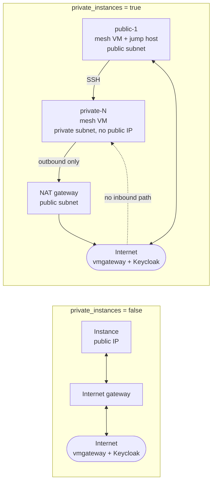

# Terraform: VM instances in AWS, GCP and Azure

Creates the Linux VMs that [`../vm`](../vm) then onboards into the mesh, in any
one cloud or in several at once, with the instance count set per cloud and an
optional private-subnet-behind-NAT layout.

It stops one step short of onboarding, deliberately: each instance comes up with
the packages installed and a ready-to-use `vm.env` at `/opt/vm-onboarding/`, and
`../vm/push-to-vm.sh` finishes the job. That keeps the Keycloak client secret out
of the Terraform state, and keeps the credential plugin binary - which Terraform
has no good way to ship - handled by the tool that already copies it.

## Layout

```
terraform/
├── deploy.sh              drives one or more stacks with a shared tfvars
├── deploy.conf            which clouds deploy.sh acts on by default
├── common.tfvars.example  settings shared by every cloud
├── outputs/               saved outputs, written on every apply (gitignored)
├── modules/
│   ├── bootstrap/         renders the cloud-init script and vm.env (no provider)
│   ├── aws/               VPC, subnets, NAT gateway, security groups, instances
│   ├── gcp/               VPC, subnet, Cloud NAT, firewall rules, instances
│   └── azure/             resource group, VNet, NAT gateway, NSGs, instances
└── stacks/
    ├── aws/               a Terraform root with only the AWS provider
    ├── gcp/               ... only the Google provider
    └── azure/             ... only the AzureRM provider
```

**Why one stack per cloud rather than one root module with `count`.** Terraform
configures every provider a configuration mentions, whether or not it creates
anything with it - and the AzureRM provider *authenticates while it is being
configured*. In a single root module holding all three providers, an AWS-only run
fails trying to get an Azure token, even with every Azure resource counted out to
zero. No placeholder credential avoids it. Separate roots are the only way to
make "AWS only" need AWS credentials only, and they give each cloud its own state
and blast radius as a bonus.

## Quick start

```shell
cd terraform
cp common.tfvars.example common.tfvars
vi common.tfvars                 # SSH CIDR, key, mesh CIDRs, onboarding settings

cp stacks/aws/aws.tfvars.example stacks/aws/aws.tfvars
vi stacks/aws/aws.tfvars         # region, instance_count, instance_type

./deploy.sh plan aws
./deploy.sh apply aws
./deploy.sh onboard aws          # prints the push-to-vm.sh command per instance
```

Then onboard, from the `vm/` directory, with the real secret:

```shell
cd ../vm
KEYCLOAK_CLIENT_SECRET='<the client secret>' ./push-to-vm.sh ec2-user@<ip>
```

## Choosing clouds and counts

The cloud is chosen by which stacks you run, and the count by that stack's
`instance_count`.

```shell
./deploy.sh apply aws                 # AWS only
./deploy.sh apply aws azure           # AWS and Azure
./deploy.sh apply aws gcp azure       # all three
./deploy.sh apply                     # whatever deploy.conf lists
```

`deploy.conf` sets the default so a bare `./deploy.sh apply` does the right thing
for a given checkout:

```shell
CLOUDS="aws gcp"
```

Instance counts are per cloud, in each stack's tfvars - two in AWS and one in
Azure is just:

```hcl
# stacks/aws/aws.tfvars
instance_count = 2

# stacks/azure/azure.tfvars
instance_count = 1
```

`instance_count = 0` keeps the network but removes the instances, which is a
cheap way to park an environment.

Each stack keeps its own state, so applying AWS never touches GCP or Azure, and
`./deploy.sh destroy aws` leaves the others running.

## Public instances, or private behind a NAT gateway

One flag in `common.tfvars` decides the layout for every cloud at once:

```hcl
private_instances = false   # every instance: public subnet, public IP
private_instances = true    # every instance: private subnet, egress via NAT
```

So with `instance_count = 2`, `private_instances = false` gives **two public**
instances and `private_instances = true` gives **two private** ones plus one
public - the flag applies to all of `instance_count`, and the extra public
instance is the way in. See [Reaching private instances](#reaching-private-instances).



With `private_instances = true`:

| | AWS | GCP | Azure |
| --- | --- | --- | --- |
| Egress | NAT Gateway + EIP | Cloud NAT + Cloud Router | NAT Gateway + public IP |
| Instance address | private only | no `access_config` | no public IP on the NIC |
| Reached over SSH | through `public-1` | through `public-1` | through `public-1` |

The NAT gateway is what makes onboarding work at all from a private subnet: the
agent downloads its packages from the vmgateway over 443 and the credential
plugin fetches tokens from Keycloak over 443, both outbound. Nothing needs to
reach *in* except the mesh traffic from the cluster.

`CONNECTED_OVER` in the generated `vm.env` follows each instance's placement -
`VPC` for a private one, `INTERNET` for a public one - because that decides which
address the cluster puts in the `WorkloadEntry`. Override it for every instance
with `onboarding.connected_over` if your routing differs.

For `INTERNET` to mean anything, the VM also needs the HostInfo plugin, which the
generated `vm.env` enables (`HOSTINFO_MODE="plugin"`). The agent's built-in
interface scan cannot see a public address on any of these clouds, because it is
NAT'd to the instance rather than configured on an interface.

**Each instance needs its own Keycloak client.** The `WorkloadEntry` name is
derived from the token's subject, which for a `client_credentials` token is the
client's service-account UUID - so instances sharing a client collide on one
entry and overwrite each other's address. Terraform does not create those
clients; see `k8s/keycloak/add-client.sh`.

### Mixing both placements in one cloud

To get, say, **two private and one public** in the same cloud, set the two counts
in that cloud's own tfvars rather than using the shared flag:

```hcl
# stacks/aws/aws.tfvars
private_instance_count = 2
public_instance_count  = 1
```

When either is set, `instance_count` and `private_instances` no longer apply to
that stack - the counts say everything. Either may be `0`.

You get one subnet pair and one NAT gateway serving the whole stack, and the
instances are named after their placement:

```
tsb-vm-private-1    private subnet, no public IP, egress via NAT, CONNECTED_OVER=VPC
tsb-vm-private-2    private subnet, no public IP, egress via NAT, CONNECTED_OVER=VPC
tsb-vm-public-1     public subnet, public IP,     direct egress,  CONNECTED_OVER=INTERNET
```

Here `public-1` is both a workload and the jump host for the two private
instances, so no extra instance is added. Each group is spread over the
availability zones independently, and `ssh_commands` / `onboard_commands` print
the right form per instance with the instance key in a trailing comment.

Placements can also differ *between* clouds without any of this, because each
cloud is its own stack - run AWS with `private_instances = false` and Azure with
`true` by passing a different shared file, or just set the counts in each.

Instances are keyed by name (`private-1`, `public-1`, ...) rather than by
position, so raising `private_instance_count` from 2 to 3 adds `private-3` and
leaves the existing instances untouched.

### Reaching private instances

A private instance has no inbound path from the internet, so something in the
public subnet has to be jumped through. Rather than a bastion that does nothing
else, **one of the public mesh VMs takes that job** - and if the counts asked for
no public instance, one is added:

```hcl
private_instances = true
instance_count    = 2
```

builds **three** instances:

```
tsb-vm-private-1   mesh VM, private subnet, egress via NAT
tsb-vm-private-2   mesh VM, private subnet, egress via NAT
tsb-vm-public-1    mesh VM, public subnet  +  the SSH jump host
```

`public-1` is onboarded exactly like the others - it runs the workload, joins the
same `WorkloadGroup` and carries mesh traffic. Being the way in is just a role it
also happens to carry, so nothing sits idle. `./deploy.sh onboard` lists it
alongside the rest:

```shell
KEYCLOAK_CLIENT_SECRET='<secret>' ./push-to-vm.sh ec2-user@203.0.113.9   # public-1
KEYCLOAK_CLIENT_SECRET='<secret>' SSH_JUMP=ec2-user@203.0.113.9 \
  ./push-to-vm.sh ec2-user@10.42.100.23                                  # private-1
```

`SSH_JUMP` is what routes the private instance through the public one. Add
`SSH_KEY=<path to the private key>` when the key is not the one ssh would pick by
default, and `DRY_RUN=1` to see the `ssh`/`scp` commands without running them:

```shell
DRY_RUN=1 SSH_JUMP=ec2-user@203.0.113.9 SSH_KEY=~/.ssh/vm.pem \
  ./push-to-vm.sh ec2-user@10.42.100.23
```

If the counts already ask for a public instance, none is added and the first one
becomes the jump host - `private_instance_count = 2, public_instance_count = 1`
is three instances, not four.

The `placement` output says exactly what happened, so the count is never a
surprise:

```shell
$ terraform -chdir=stacks/aws output placement
{
  "private_instances" = 2
  "public_instances" = 1
  "total" = 3
  "jump_host" = "public-1"
  "public_instance_added_for_access" = true
}
```

#### When you already have connectivity

With a VPN, Direct Connect, SSM, IAP or Azure Bastion into the subnet, no jump
host is wanted at all:

```hcl
public_jump_host = false
```

Nothing is added, no instance is designated, and the private instances take SSH
straight from `ssh_allowed_cidrs` - the printed commands then address their
private IPs directly.

| `private_instances` | `public_jump_host` | Result |
| --- | --- | --- |
| `false` | ignored | all public, SSH from `ssh_allowed_cidrs` |
| `true` | `true` (default) | private instances **+ one public mesh VM** that is also the jump host |
| `true` | `false` | private instances only; SSH to their private IPs from `ssh_allowed_cidrs` |

## Who owns the GCP project

By default the GCP stack builds **inside a project that already exists** -
`project_id` has to name one, and `destroy` leaves the project alone.

It can also own the project outright, which is the cleanest way to run a demo
environment: everything, including the project, appears and disappears together.

```hcl
# stacks/gcp/gcp.tfvars
project_id              = "my-demo-project"
create_project          = true
org_id                  = "775566979306"      # gcloud organizations list
billing_account         = "0183E5-..."        # gcloud billing accounts list
project_deletion_policy = "DELETE"
```

Billing is not optional here: without it the Compute Engine API cannot be used
and the instances fail even though the project exists. Terraform links the
account, enables `compute.googleapis.com`, and waits for both before creating
anything inside.

Two details that are easy to get wrong:

* **`deletion_policy` defaults to `PREVENT` in the provider**, which makes
  `terraform destroy` quietly leave the project behind. This stack defaults it to
  `DELETE` instead, because a project Terraform created should be a project
  Terraform can remove. Set it to `PREVENT` if you would rather it survive.
* **GCP never releases a project ID.** A project destroyed this way cannot be
  recreated under the same name - ever. Choose the ID accordingly, and expect to
  add a suffix if you tear down and rebuild.

### When the project already exists

Terraform cannot adopt a resource it has never seen, so setting
`create_project = true` against a project that is already there fails with
`project already exists` (HTTP 409). Import it once instead:

```shell
terraform -chdir=stacks/gcp import 'google_project.this[0]' <project-id>
terraform -chdir=stacks/gcp import \
  'google_project_service.this["compute.googleapis.com"]' \
  '<project-id>/compute.googleapis.com'
```

The following plan should then report the project as *updated in place* - picking
up the labels and the deletion policy - and never as created or replaced. If it
wants to create it, the import did not take.

A detection-based alternative ("create it only if missing") is deliberately not
offered: once Terraform had created the project, the next plan would find it
existing and propose removing it from state, which is worse than an explicit
flag.

## Mandatory Tetrate tags

The sandbox accounts enforce a tag policy: a resource without the governance tags
will not come up. They are applied to every taggable resource in all three
clouds, and the values live in `common.tfvars`:

```hcl
tetrate_tags = {
  tetrate_owner    = "nizam"
  tetrate_team     = "sales:ce"
  tetrate_purpose  = "demo"
  tetrate_lifespan = "ongoing"
  tetrate_customer = "apigw-demo"
}
```

Override only what you need - anything omitted keeps its default. An empty or
whitespace-only value fails the plan with a named error rather than producing a
resource the account will reject:

```
Every tetrate_tags value must be non-empty: the cloud accounts reject untagged
resources. Check tetrate_owner, tetrate_team, tetrate_purpose, ...
```

These tags are merged *last*, after `tags`, so a stray entry in `tags` cannot
override one of them.

Check what will actually be applied before you apply it:

```shell
terraform -chdir=stacks/aws   output applied_tags
terraform -chdir=stacks/gcp   output applied_labels
terraform -chdir=stacks/azure output applied_tags
```

### `sales:ce` on GCP

GCP label values accept only lowercase letters, digits, `-` and `_`, so a colon
is not representable. The GCP stack converts the values once and reports exactly
what changed:

```shell
$ terraform -chdir=stacks/gcp output labels_rewritten_for_gcp
{
  "tetrate_team" = {
    "requested" = "sales:ce"
    "applied"   = "sales-ce"
  }
}
```

AWS and Azure take `sales:ce` verbatim. If the GCP side of the tag policy expects
something other than `sales-ce`, set `tetrate_team` to that value - it is just a
variable.

### Coverage, and where the clouds make it impossible

Every resource whose provider schema has a `tags`/`labels` attribute carries
them. The ones that do not are resources the provider gives no way to tag - all
of them associations, rules or GCP network objects:

| Cloud | How they are applied | Resources that cannot be tagged |
| --- | --- | --- |
| AWS | provider `default_tags`, plus explicit `tags` on every resource and on the root EBS volumes | `aws_security_group_rule`, `aws_route_table_association` |
| GCP | provider `default_labels`, plus `labels` on instances and boot disks | `google_compute_network`, `_subnetwork`, `_firewall`, `_router`, `_router_nat` - GCP supports no labels on any of these |
| Azure | explicit `tags` on every resource (azurerm has no `default_tags`) | `azurerm_subnet`, `azurerm_network_security_rule`, and the three `*_association` resources |

This was checked against the provider schemas rather than assumed - AWS 5.100,
Google 6.50, AzureRM 4.81. If the tag policy is enforced on VPCs or subnets in
GCP, it cannot be satisfied from Terraform because the API has nowhere to put a
label; the instances and disks, which is what the policy normally targets, are
covered.

## Settings

Shared, in `common.tfvars`:

| Variable | Meaning |
| --- | --- |
| `name_prefix` | prefixes every resource name |
| `tetrate_tags` | **mandatory** governance tags - see above |
| `ssh_allowed_cidrs` | **required** - who may reach SSH |
| `ssh_public_key_path` / `ssh_public_key` | the key to install |
| `mesh_allowed_cidrs` | where the cluster's mesh traffic comes from |
| `mesh_ports` | which ports that traffic may use (defaults cover the sidecar) |
| `private_instances` | public subnet, or private behind NAT |
| `public_jump_host` | whether a public mesh VM doubles as the SSH jump host |
| `prepare_onboarding` | install packages and write `vm.env`, or leave the VM bare |
| `onboarding` | the values written into `/opt/vm-onboarding/vm.env` |

Per cloud, in `stacks/<cloud>/<cloud>.tfvars`:

| AWS | GCP | Azure |
| --- | --- | --- |
| `region`, `availability_zones` | `project_id` (required), `region`, `zone` | `subscription_id`, `location` |
| — | `create_project`, `org_id`, `billing_account` - see above | — |
| `instance_count`, `instance_type` | `instance_count`, `machine_type` | `instance_count`, `vm_size` |
| `private_instance_count`, `public_instance_count` - the explicit split | same | same |
| `os`, `ami_id` | `os`, `image` | `os`, `image` |
| `vpc_cidr`, `root_volume_size` | `subnet_cidr`, `root_volume_size` | `vnet_cidr`, `root_volume_size` |
| — | — | `admin_username` |

### Images and login accounts

| `os` | AWS | GCP | Azure | SSH user |
| --- | --- | --- | --- | --- |
| `rhel9` (default) | RHEL 9 (Red Hat) | `rhel-cloud/rhel-9` | RedHat RHEL `9-lvm-gen2` | `ec2-user` / `tsbadmin` / `azureuser` |
| `rhel8` | RHEL 8 | `rhel-cloud/rhel-8` | RedHat RHEL `8-lvm-gen2` | as above |
| `rocky9` | Rocky 9 | `rocky-linux-cloud/rocky-linux-9` | set `image` | `rocky` / `tsbadmin` |
| `centos-stream9` | CentOS Stream 9 | `centos-cloud/centos-stream-9` | set `image` | `ec2-user` / `tsbadmin` |

The SSH user is reported in the `instances` output and baked into the printed
commands, so you never have to guess it.

Two caveats worth knowing:

* **Azure only maps the RHEL images**, because they are plain pay-as-you-go
  images needing no marketplace plan acceptance. Rocky, Alma and CentOS Stream on
  Azure come from marketplace publishers whose terms must be accepted first, and
  such images also need a `plan` block that `modules/azure` does not set:
  ```shell
  az vm image terms accept --publisher resf --offer rockylinux-x86_64 --plan 9-base
  ```
  then set `image` and add the `plan` block to `modules/azure/main.tf`.
* **The AWS AMI lookup is by owner and name pattern.** Red Hat's own AMIs are
  stable; the Rocky and CentOS Stream patterns can drift as those projects change
  their naming. If a lookup returns nothing, pass `ami_id` explicitly.

## What ends up on each instance

With `prepare_onboarding = true` (the default), cloud-init:

1. installs `curl`, `gettext`, `libcap` and `python3` - what `vm/install-vm.sh`
   checks for;
2. writes `/opt/vm-onboarding/vm.env` with the `onboarding` values, the right
   `CONNECTED_OVER`, and `KEYCLOAK_CLIENT_SECRET` left empty;
3. adds the sidecar's egress hostnames to `/etc/hosts` on `127.0.0.2`;
4. leaves a note in `/etc/motd` saying how to finish, and a log at
   `/var/log/vm-onboarding-bootstrap.log`.

It does **not** install the onboarding agent or onboard the VM. Inspect what will
be written before applying:

```shell
terraform -chdir=stacks/aws console -var-file=../../common.tfvars
> module.bootstrap.vm_env
```

## Outputs

Every stack exposes the same shape, so the commands look alike whichever cloud
you used:

```shell
./deploy.sh output aws
terraform -chdir=stacks/aws output -json instances | jq
```

### Saved to files as well as printed

Every `apply` and `output` writes the outputs under `outputs/`, so the addresses
are there to share or script against without another Terraform run:

| File | What it is |
| --- | --- |
| `outputs/<cloud>.txt` | the readable form, exactly as printed, plus a header saying when it was written |
| `outputs/<cloud>.json` | the same data for `jq` and scripts |
| `outputs/<cloud>-onboard.sh` | written by `./deploy.sh onboard` - a runnable script, one `push-to-vm.sh` line per instance |

```shell
./deploy.sh apply aws            # prints the outputs and saves them
./deploy.sh output aws gcp       # refresh the files for two stacks
./deploy.sh onboard aws          # also writes outputs/aws-onboard.sh

jq -r '.instances.value[] | "\(.key)\t\(.placement)\t\(.ssh_host)"' outputs/aws.json
```

The onboarding script takes the client secret from the environment - it is never
written into the file:

```shell
cd ../vm
KEYCLOAK_CLIENT_SECRET='<the client secret>' bash ../terraform/outputs/aws-onboard.sh
```

The files are gitignored: they are not secrets, but they describe your account
and they go stale. `destroy` deletes them rather than leaving them describing
things that no longer exist, and an empty state leaves any existing file alone
instead of overwriting it with nothing. Point them elsewhere with `OUTPUT_DIR`.

| Output | What it holds |
| --- | --- |
| `instances` | per instance: name, id, private/public IP, zone, the SSH host and user |
| `jump_host` | the public mesh VM used as the way in, or `null` |
| `placement` | how many private/public instances, which is the jump host, and whether one was added |
| `network` | VPC/VNet and subnet ids, and the NAT egress address when private |
| `ssh_commands` | ready-to-paste `ssh`, with `ProxyJump` where needed |
| `onboard_commands` | the matching `push-to-vm.sh` invocation |
| `plane_uid` | the UID these instances expect in the token's `aud` |
| `connected_over` | the value written into `vm.env` |

`network.egress_ip` is worth noting for private deployments: it is the address
the onboarding traffic appears to come from, so it is what to allow if Keycloak
or the vmgateway filters by source address. On GCP, Cloud NAT allocates addresses
automatically - read them with
`gcloud compute routers get-nat-mapping-info <router> --region <region>`.

## How this fits the rest of the repository

```
k8s/      prepare the cluster            (once per cluster)
terraform/ create the VMs                (this directory)
vm/       onboard each VM into the mesh  (once per VM)
```

The `onboarding` block in `common.tfvars` should match what you set in
`k8s/cp.env`, in particular `vm_endpoint`, the realm URL and the workload group.
Three things still have to be true before a VM onboards, none of which Terraform
does:

1. `k8s/install-cp.sh` has run against the cluster.
2. The Keycloak client has an Audience mapper for the plane UID -
   `k8s/keycloak/add-audience.sh "$(./deploy.sh output aws | grep plane_uid)"`.
3. `vm_endpoint` resolves to the vmgateway **from the instances**, and the
   cluster can route to them on `mesh_ports`.

See the [top-level README](../README.md) for the full picture.

## Cost and teardown

Each NAT gateway is billed hourly plus per GB in all three clouds, so a private
layout costs meaningfully more than a public one. There is no bastion to pay for
on top - the jump host is one of the mesh VMs you wanted anyway - but note that
asking for private instances adds one public instance unless
`public_jump_host = false`. Tear down what you are not using:

```shell
./deploy.sh destroy aws
./deploy.sh destroy              # the clouds in deploy.conf
```

State is local by default (`stacks/<cloud>/terraform.tfstate`), which is fine for
a lab but not for shared or long-lived use. For anything shared, add a backend to
each stack - for example `stacks/aws/backend.tf`:

```hcl
terraform {
  backend "s3" {
    bucket = "my-tf-state"
    key    = "tsb-vm-onboarding/aws.tfstate"
    region = "us-east-1"
  }
}
```

## Validation status

The three stacks and four modules pass `terraform validate` against AWS provider
5.100, Google 6.50 and AzureRM 4.81, and `terraform fmt` is clean. The AWS stack
was planned end to end up to the point of the first real API call, the cloud-init
and `vm.env` rendering was checked against what `vm/install-vm.sh` reads, and the
placement matrix was verified to resolve as documented across seven cases -
all-public, all-private, the explicit 2-private/1-public split, each count at
zero, a partial split, and private-with-no-jump-host; the jump-host logic was
checked over eight cases, including that asking for private instances adds
exactly one public mesh VM and that an explicitly requested public instance is
reused rather than duplicated. The Tetrate tags were checked end to end:
applied verbatim on AWS and Azure, rewritten to "sales-ce" on GCP, and an empty
value rejected at plan time; tag coverage was confirmed against the three
provider schemas rather than assumed. Nothing here has been applied to a real cloud
account, so treat the first `apply` as a commissioning run and read the `plan`.
